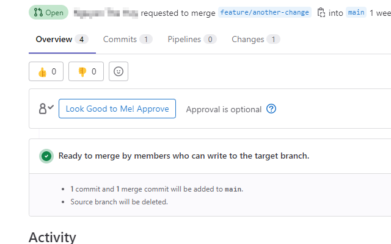
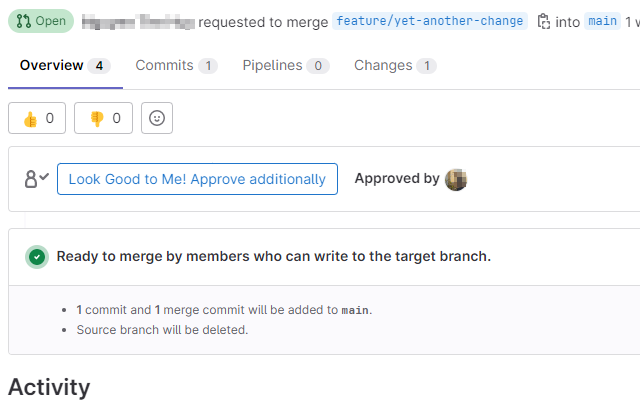
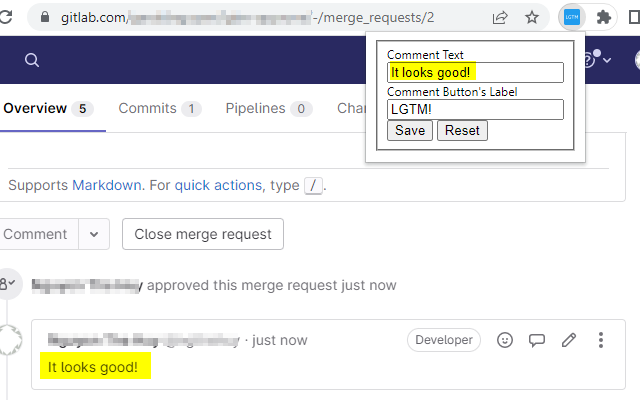

# LGTM - Approve! Chrome Extension

https://chrome.google.com/webstore/detail/lgtm-approve/odeollamfjdmamamonbfigajkhakcmag/

A chrome extension that automatically adds a comment while approving the request. Doing so cements the collaboration between the reviewer and the merge request's submitter

The comment is default to "LGTM" (Look Good to Me) and can be customized.

*Replace Gitlab's Approve button by "Look Good to Me! Approve" button*

*Replace Gitlab's "Approve Additionally" button by "Look Good to Me! Approve Additionally" button*

*Allow customizing comment text and button's label*